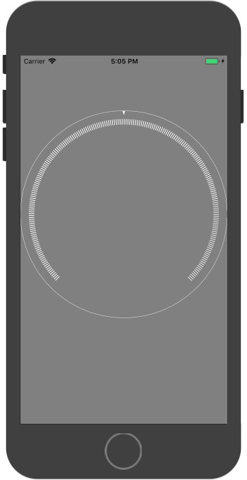

# YLCircleView

刻度盘效果 CAShapeLayer <br/>



## Example

```
_tickView = [TickCircleView tickViewWithProColor:[UIColor whiteColor] trackColor:[UIColor whiteColor]];
_tickView.frame = CGRectMake(0, 100, self.view.bounds.size.width, 370/440.0* self.view.bounds.size.width);
_tickView.progress = 0.8;
[self.view addSubview:_tickView];
```

## TickCircleView

刻度盘view

```
TickCircleTypeOpenBottom, //下开口圆
TickCircleTypeCircle,//整圆
```


## TickCircleShapeLayer

刻度圆环 使用例子如下:

```
TickCircleShapeLayer * tkLayer = [[TickCircleShapeLayer alloc]initLayerWithArcCenter:CGPointMake(200, 400) radius:80 style:TickCircleTypeCustom]; //TickCircleTypeCircle TickCircleTypeOpenBottom
tkLayer.dataSource = self;
tkLayer.trackColor = [UIColor grayColor];//设置圆环底色
tkLayer.progressColor = [UIColor redColor];//设置圆环进度颜色
tkLayer.progressWidth = 10.0;//设置圆环刻度宽
tkLayer.progress = 0.7; //设置进度
[tkLayer setProgress:0.7 animated:YES]; //设置进度带动画
[self.view.layer addSublayer:tkLayer];
```

